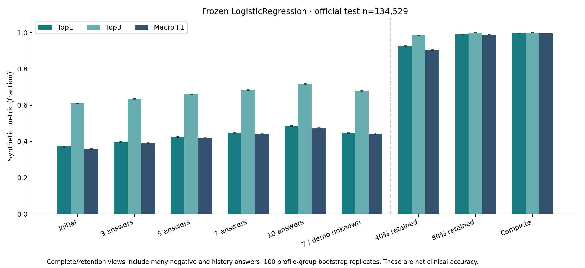
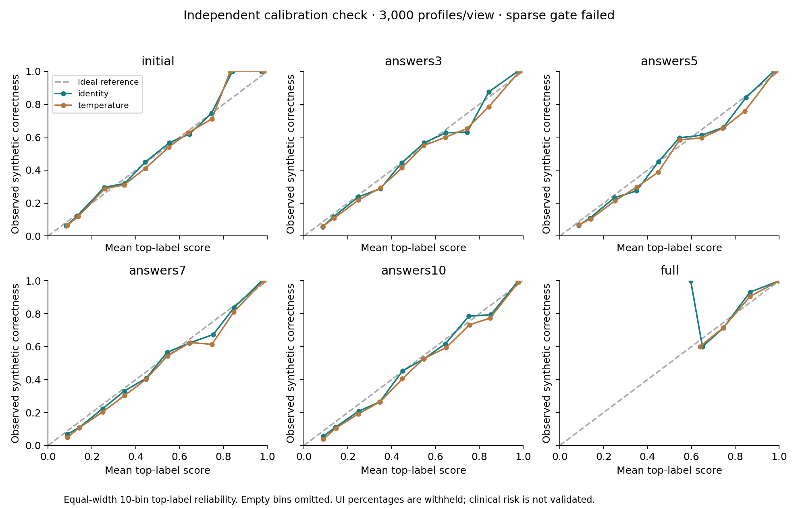
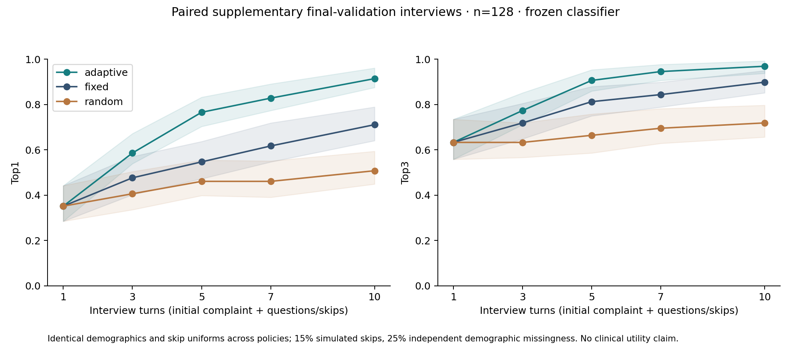

# Measured evaluation report — 2 October 2026

All results below came from completed commands. These are synthetic DDXPlus results, not clinical diagnosis accuracy, clinical risk or validation for India. One selected classifier performs inference. Complete-record results are not the sparse-interview headline.

## Baseline reproduced

The preserved original app ran under a clean Python 3.12 environment. Its dataset has 4,920 training rows, 132 features, 41 labels and only 304 unique profiles; 4,616 rows repeat profiles. 41/42 official legacy test profiles are seen in training. Active SVC Top-1/Top-3/Macro-F1 were 1.0 on those 42 rows; raw-row and deduplicated five-fold scores also were 1.0. Those numbers do not establish generalization. Symptom dropout Top-1 was 1.0000 / 0.9762 / 0.8810 / 0.6667 at retention 1.0 / 0.8 / 0.6 / 0.4. The legacy malformed symptom list was accepted and matched the empty vector, whereas the new contract rejects unknown IDs. JSON evidence is retained.

## Data and evaluation protocol

Whole-file scans validated 1,025,602 training, 132,448 validation and 134,529 test rows. Invalid row/token counts were zero. Training deduplicated 29,823 profiles. Full training-profile exclusion removed 4,471 validation rows. Training used 32,296 base profiles (32,000 representative uniform-priority samples plus 296 disclosed rare supplements), 161,480 augmented views, 1,200 shared features, and independent 25% demographic dropout.

Validation is profile-isolated before masking and split into model tuning, calibration fit, calibration check and final validation. Used subsets: 6,000 tune, 3,000 calibration-fit, 3,000 independent check and 6,000 final-validation profiles. There is no real-person patient ID; profiles group identical observed age/sex/evidence. Official test did not select, calibrate or break ties. Macro-F1 explicitly includes all 49 labels, with zero for missing-support classes; support <30 is flagged. Bootstrap uses 100 whole-profile-group replicates (percentile 95% intervals), not augmented rows. All release hashes and split/support counts are in data_manifest.json.

The training multi-choice scan found 6,367 valid groups exceeding the paper's five-option statement; E_54 reached seven options. Valid released domain sets are preserved. Five missing parent references are explicit engineering exceptions without clinician review.

## Candidate decision from validation

Predeclared score: mean all-label Macro-F1 across initial-only, 40% retention and adaptive 3/5/7/10-turn tuning rollouts. Rollouts n=128; within 0.002 prefer lower warm one-row p95. The small rollout subset introduces selection uncertainty and weak rare-class coverage. No candidate hyperparameter search or test-driven change was performed.

| Candidate | Selection score | Fit seconds | One-row p95 ms | Uncompressed model bytes | Warnings |
|---|---:|---:|---:|---:|---|
| LogisticRegression | 0.5650 | 122.73 | 0.170 | 479,455 | 0 |
| HistGradientBoosting | 0.5070 | 457.31 | 17.226 | 3,221,904 | 0 |

**Selected: LogisticRegression**, score 0.5650. Selection/parameters/artifact SHA were frozen before official test inference. Shipped compressed bundle: 317,802 bytes; SHA256 `6b7e471e8108b2b3192d2c4839a3ad943a4b1ec39b94bbe75a0bff2953e01635`.

| Tune evidence view | LR Top-1 / Top-3 / Macro-F1 | HGB Top-1 / Top-3 / Macro-F1 |
|---|---|---|
| initial | 0.3627 / 0.5967 / 0.3425 | 0.3668 / 0.6032 / 0.3557 |
| answers3 | 0.3915 / 0.6315 / 0.3755 | 0.3973 / 0.6318 / 0.3858 |
| answers5 | 0.4133 / 0.6568 / 0.3996 | 0.4172 / 0.6538 / 0.4095 |
| answers7 | 0.4378 / 0.6713 / 0.4234 | 0.4477 / 0.6788 / 0.4368 |
| answers10 | 0.4738 / 0.7192 / 0.4398 | 0.4808 / 0.7142 / 0.4656 |
| retention40 | 0.9237 / 0.9832 / 0.9016 | 0.9167 / 0.9837 / 0.8951 |
| retention80 | 0.9902 / 1.0000 / 0.9893 | 0.9875 / 0.9998 / 0.9860 |
| full | 0.9953 / 1.0000 / 0.9948 | 0.9945 / 1.0000 / 0.9938 |
| unknown_demographics7 | 0.4465 / 0.6727 / 0.4248 | 0.4432 / 0.6738 / 0.4225 |

## Official frozen test and overlap

All 134,529 official rows were evaluated, with 134,259 unique profiles and 270 repeated rows. 4,901 rows match the full training release; 129,628 rows are unseen in training. 129,259 are unseen across both training and retained validation. Overlap counts are not added without their union.

Random-answer masks retain the initial complaint and budget completed applicable answers. Retention masks include many negative/history answers, not a few symptom selections. Demographics are known except the explicit missingness view. Test masks use fixed 2,048-row chunks and recorded seeds; validation uses one subset-sized call, so identical masking percentages do not imply identical row-level masks. Full retention preserves every applicable canonical answer.

| Official test view | Mean known answers | Top-1 | Top-3 | Macro-F1 | Weighted-F1 | Log loss | Brier sum | ECE |
|---|---:|---:|---:|---:|---:|---:|---:|---:|
| initial | 1.00 | 0.3729 | 0.6095 | 0.3597 | 0.3614 | 1.9014 | 0.7017 | 0.0103 |
| answers3 | 3.00 | 0.3991 | 0.6362 | 0.3904 | 0.3946 | 1.8094 | 0.6748 | 0.0104 |
| answers5 | 5.00 | 0.4252 | 0.6611 | 0.4188 | 0.4226 | 1.7205 | 0.6491 | 0.0131 |
| answers7 | 7.00 | 0.4486 | 0.6844 | 0.4392 | 0.4470 | 1.6412 | 0.6245 | 0.0197 |
| answers10 | 10.00 | 0.4861 | 0.7180 | 0.4737 | 0.4851 | 1.5210 | 0.5877 | 0.0234 |
| retention40 | 85.47 | 0.9268 | 0.9862 | 0.9067 | 0.9268 | 0.2007 | 0.1002 | 0.0045 |
| retention80 | 171.46 | 0.9919 | 0.9999 | 0.9899 | 0.9919 | 0.0216 | 0.0123 | 0.0005 |
| full | 215.03 | 0.9972 | 1.0000 | 0.9966 | 0.9971 | 0.0089 | 0.0048 | 0.0007 |
| unknown_demographics7 | 7.00 | 0.4471 | 0.6800 | 0.4425 | 0.4443 | 1.6503 | 0.6262 | 0.0170 |

| View | Official Top-1 95% CI | Unseen-training Top-1 / Top-3 / Macro-F1 | Unseen-training Macro-F1 95% CI |
|---|---|---|---|
| initial | 0.3702–0.3750 | 0.3654 / 0.6021 / 0.3519 | 0.3479–0.3553 |
| answers3 | 0.3967–0.4013 | 0.3921 / 0.6298 / 0.3833 | 0.3795–0.3864 |
| answers5 | 0.4226–0.4273 | 0.4185 / 0.6554 / 0.4107 | 0.4059–0.4146 |
| answers7 | 0.4463–0.4511 | 0.4418 / 0.6790 / 0.4305 | 0.4264–0.4345 |
| answers10 | 0.4837–0.4889 | 0.4796 / 0.7131 / 0.4653 | 0.4614–0.4685 |
| retention40 | 0.9253–0.9280 | 0.9256 / 0.9860 / 0.9047 | 0.9019–0.9077 |
| retention80 | 0.9915–0.9925 | 0.9917 / 0.9999 / 0.9897 | 0.9888–0.9906 |
| full | 0.9969–0.9975 | 0.9970 / 1.0000 / 0.9966 | 0.9963–0.9969 |
| unknown_demographics7 | 0.4447–0.4490 | 0.4409 / 0.6753 / 0.4348 | 0.4291–0.4397 |

Detailed all-class confusion matrices, per-class recall/support, reliability bin counts, all Top-k/Macro-F1 intervals, unseen-training-and-validation results and subgroup slices are retained in official_test_report.json. They are not replaced by one rounded headline.

## Adaptive questions and paired validation audit

Turn budgets include the initial complaint and skipped questions. Frozen final-validation and official-test interviews each used 128 profiles, with 15% simulated skips and independent 25% age/sex missingness. They reveal only the chosen hidden answer after selection; reference differential and full hidden labels never rank questions. These are simulated interviews, not patient utility tests.

The frozen random baseline consumed a shared RNG for question choices, changing later profiles' demographic draws. Its initial metric therefore differs slightly from adaptive/fixed, and that original output remains disclosed. A supplementary **paired final-validation audit** separated choice RNG and paired demographics/skip uniforms for all policies, with the already-frozen classifier and no model-selection change. This supplementary report is validation-only; official outputs retain the pre-frozen evaluation code.

| Paired validation policy | Turns | Mean completed answers | Top-1 | Top-3 | Macro-F1 |
|---|---:|---:|---:|---:|---:|
| adaptive | 1 | 1.00 | 0.3516 | 0.6328 | 0.2322 |
| adaptive | 3 | 2.66 | 0.5859 | 0.7734 | 0.4323 |
| adaptive | 5 | 4.41 | 0.7656 | 0.9062 | 0.6305 |
| adaptive | 7 | 6.09 | 0.8281 | 0.9453 | 0.6853 |
| adaptive | 10 | 8.56 | 0.9141 | 0.9688 | 0.7453 |
| random | 1 | 1.00 | 0.3516 | 0.6328 | 0.2322 |
| random | 3 | 2.66 | 0.4062 | 0.6328 | 0.2760 |
| random | 5 | 4.41 | 0.4609 | 0.6641 | 0.3353 |
| random | 7 | 6.09 | 0.4609 | 0.6953 | 0.3630 |
| random | 10 | 8.56 | 0.5078 | 0.7188 | 0.4129 |
| fixed | 1 | 1.00 | 0.3516 | 0.6328 | 0.2322 |
| fixed | 3 | 2.66 | 0.4766 | 0.7188 | 0.3752 |
| fixed | 5 | 4.41 | 0.5469 | 0.8125 | 0.4287 |
| fixed | 7 | 6.09 | 0.6172 | 0.8438 | 0.4737 |
| fixed | 10 | 8.56 | 0.7109 | 0.8984 | 0.5490 |

| Frozen official-test interview policy | Turns | Mean completed answers | Top-1 | Top-3 | Macro-F1 |
|---|---:|---:|---:|---:|---:|
| adaptive | 1 | 1.00 | 0.3203 | 0.5312 | 0.2396 |
| adaptive | 3 | 2.70 | 0.5625 | 0.8516 | 0.3870 |
| adaptive | 5 | 4.39 | 0.7344 | 0.9062 | 0.5837 |
| adaptive | 7 | 6.05 | 0.8203 | 0.9375 | 0.6239 |
| adaptive | 10 | 8.65 | 0.8984 | 0.9609 | 0.7255 |
| random | 1 | 1.00 | 0.3203 | 0.5234 | 0.2336 |
| random | 3 | 2.67 | 0.3516 | 0.5781 | 0.2560 |
| random | 5 | 4.45 | 0.3828 | 0.6328 | 0.2936 |
| random | 7 | 6.17 | 0.3906 | 0.6016 | 0.2954 |
| random | 10 | 8.72 | 0.4375 | 0.6172 | 0.3170 |
| fixed | 1 | 1.00 | 0.3203 | 0.5312 | 0.2396 |
| fixed | 3 | 2.70 | 0.4141 | 0.6875 | 0.3240 |
| fixed | 5 | 4.39 | 0.4531 | 0.7344 | 0.3598 |
| fixed | 7 | 6.05 | 0.5000 | 0.7734 | 0.4114 |
| fixed | 10 | 8.65 | 0.6562 | 0.8984 | 0.5281 |

The observed adaptive gain applies to these small synthetic subsets/policy assumptions. Bootstrap intervals and per-class support are retained; no guarantee of improvement, exhaustive coverage or clinical benefit follows. Seven default UI follow-up prompts may be extended explicitly; this differs from a seven-total-turn evaluation budget.

## Calibration and uncertainty

Temperature fitted on independent calibration profiles: 0.93881215. Gate passed: **False**. Compare identity versus scalar temperature, not an unsupported calibrated-risk claim. Rank-only display remains fixed irrespective of gate. ECE is top-label confidence versus correctness in ten equal-width bins; Brier is mean sum of 49 squared class errors. These definitions and per-view bins accompany the scores.

| Calibration-check view | Identity log loss / Brier / ECE | Temperature log loss / Brier / ECE |
|---|---|---|
| initial | 1.9760 / 0.7200 / 0.0198 | 1.9727 / 0.7204 / 0.0231 |
| answers3 | 1.8822 / 0.6941 / 0.0251 | 1.8798 / 0.6948 / 0.0319 |
| answers5 | 1.7951 / 0.6700 / 0.0322 | 1.7936 / 0.6708 / 0.0407 |
| answers7 | 1.7105 / 0.6454 / 0.0283 | 1.7095 / 0.6464 / 0.0352 |
| answers10 | 1.6042 / 0.6123 / 0.0338 | 1.6042 / 0.6136 / 0.0420 |
| retention40 | 0.2023 / 0.0996 / 0.0105 | 0.2030 / 0.0998 / 0.0129 |
| full | 0.0088 / 0.0049 / 0.0011 | 0.0087 / 0.0049 / 0.0006 |

## Subgroups, rare support and differential reference

Subgroups use seven-answer masks; their different synthetic class mixtures and fixed 49-label Macro-F1 do not measure a causal demographic effect or clinical fairness. No subgroup-specific thresholds were fitted.

| Test subgroup | n | Top-1 | Top-3 | Macro-F1 | ECE |
|---|---:|---:|---:|---:|---:|
| dataset_sex_M | 65,187 | 0.4470 | 0.6825 | 0.4369 | 0.0186 |
| dataset_sex_F | 69,342 | 0.4500 | 0.6861 | 0.4409 | 0.0207 |
| age_under18 | 24,591 | 0.4745 | 0.7143 | 0.3908 | 0.0147 |
| age_65plus | 19,989 | 0.4434 | 0.6752 | 0.4353 | 0.0292 |

Insufficient official-test class support (<30): none. Separate small validation/interview classes are still flagged in JSON, so absence of low-support classes on full test does not establish reliability.

Seven-answer secondary synthetic differential: top3_reference_precision=0.4903, reference_mass_in_top3=0.2999, ndcg3_reference_scores=0.5119. Reference scores are simulator-relative, not clinical ground-truth risks.

## Operational checks

Fresh local app import + model load: 1771.96 ms. Local Flask test-client warm prediction p95: 9.83 ms; next-question p95: 9.37 ms, 30 samples each, including requested service logic. Process working set after requests: 145.29 MiB. OS file cache was not cleared; measurements are local Windows results, not hosted cold/warm guarantees.

36 Python/API/model contract tests passed. Browser regression: 14 scenarios passed, no page errors, actual Chrome 154.0.8037.93. TypeScript check and Vite build passed; >500kB optional-viewer chunk warning remains. Atlas buffer/mesh/concept and interaction validators passed. pip check, JavaScript syntax and Python compile checks passed. Local staging asset copy/hashes passed. Vercel deployment/build and Linux hosted runtime were not run.

## Corrections and limits preserved

An initial training run was stopped because full-mask parent ordering dropped dependent answers; only the corrected comparison is final. Two official-test invocations stopped before test inference: a Windows UTF-8 manifest reader mismatch and a repeatedly rebuilt profile-union preparation step. Their pre-inference corrections are recorded in frozen metadata; classifier bytes, selected candidate, calibration display policy, masks and question policy were unchanged. One completed frozen official-test evaluation is delivered; no test-driven retuning or fabricated scores were used.

The limited safety rules and orphan/region applicability are engineering-reviewed, not independently clinician-reviewed. No exhaustive emergency clearance, real patient/India validation, real prevalence, proven OOD detection, clinical specialty mapping, fully reviewed Hindi evidence translation or deployed performance is claimed. Controlled text extraction is narrow and requires user confirmation. Generic primary-care navigation replaces unsupported condition-specific prescriptions/personas. Browser checks cover one desktop Chrome/software WebGL setup and 360px emulation, not all assistive technologies or real devices.

## Scientific figures

